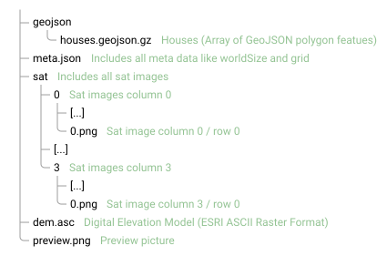

# Gruppe Adler Map Exporter

Gruppe Adler Map Exporter (grad_meh) is an Arma 3 Modification built on [intercept](https://github.com/intercept/intercept), which allows exporting Arma 3 maps.  
If you wonder what the `h` stands for you should check out [this pull request](https://github.com/gruppe-adler/grad_meh/pull/1).   

The aim of this project is not to generate finished map tiles which can be used for web-maps or similar, but to export all data which might be needed to generate such tiles or basically anything else. So the goal is to export all interesting data of a Arma 3 map. What you will do with that is up to you. The [output section](#Output) outlines what exactly is exported. 

Check out our [FAQ](#FAQ) at the bottom of this README if you ask yourself "How?" or "Why?".

## Installation
Download the latest version of the mod from our [releases page](https://github.com/gruppe-adler/grad_meh/releases). The only dependency, **which has to be loaded as well** is [intercept](https://steamcommunity.com/sharedfiles/filedetails/?id=1645973522). 

## Usage
// TODO

## Limitations
- To reduce complexity we only allow one export process at a time.
- To reduce complexity it is not possible to stop a running export reliably, except by killing the game.
- MEH cannot export maps included in `.ebo` files, because those are encrypted therefore we cannot get to the map files. 

## Output
All exported files can be found in the `grad_meh` subdirectory of your Arma 3 installation directory.  
  
Each map has its own subdirectory which has the following structure:

### `geojson` directory
// TODO
### `meta.json`
// TODO
### `sat` directory
// TODO
### `dem.asc`
// TODO
### `preview.png`
The preview image of the map as a png. This is the same image as the one shown in the map selection of the editor.

## Scripting API
Gruppe Adler Map Exporter adds a script command, which is used by the UI. If you want to, you could use that scripting command for your own purposes.

### `gradMehExportMap`
|**Syntax**| |  
|---|---|  
|Description| Exports given parts of given map. |
|||
|Syntax| **gradMehExportMap** [mapId, sat, houses, previewImg, meta, dem]
|||
|Parameters|[mapId, sat, houses, previewImg, meta, dem]: [Array](https://community.bistudio.com/wiki/Array)|
||mapId: [String](https://community.bistudio.com/wiki/String) - CfgWorlds class name of map|
||sat: [Boolean](https://community.bistudio.com/wiki/Boolean) - Export sat images|
||houses: [Boolean](https://community.bistudio.com/wiki/Boolean) - Export houses positions|
||previewImg: [Boolean](https://community.bistudio.com/wiki/Boolean) - Export preview image|
||meta: [Boolean](https://community.bistudio.com/wiki/Boolean) - Export meta.json|
||dem: [Boolean](https://community.bistudio.com/wiki/Boolean) - Export Digital Elevation Model|
|||
|Return Value| [Boolean](https://community.bistudio.com/wiki/Boolean) - [true](https://community.bistudio.com/wiki/true) if export process started correctly, [false](https://community.bistudio.com/wiki/false) if not ([Why shouldn't it?](#Limitations))|
|||
|Examples|`gradMehExportMap ["Stratis", true, true, true, true, true];`|  

## FAQ

### How does grad_meh work?
grad_meh utilizes the [arma file formats C++ library](https://github.com/gruppe-adler/grad_aff) to parse all map relevant files. So most of the magic is done there.  

### How long will an export take?
How long an export takes will vary a lot depending on what exactly you want to do, with the biggest influencing factors being map size and object count.  
But for reference: It took us about 5 minutes to export everything for Stratis.
