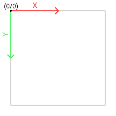

# meta.json

## 1. Introduction
This specification outlines the structure of the `meta.json` of a map.

# 2. Fields
Inside this document the term "`MAP_CONFIG`" refers to the  [CfgWorlds](https://community.bistudio.com/wiki/Arma_3_CfgWorlds_Config_Reference) class of the examined map ([`configFile`](https://community.bistudio.com/wiki/configFile)` >> "CfgWorlds" >> `[`worldName`](https://community.bistudio.com/wiki/worldName)).

| Field | Type | Example | Description |
| --- | --- | --- | --- |
| `author` | `string` | `"Bohemia Interactive"` | Map author (corresponds with [`MAP_CONFIG >> "description"`](https://community.bistudio.com/wiki/Arma_3_CfgWorlds_Config_Reference#author)) |
| `displayName` | `string` | `"Stratis"` | Display name (corresponds with [`MAP_CONFIG >> "description"`](https://community.bistudio.com/wiki/Arma_3_CfgWorlds_Config_Reference#description)) |
| `elevationOffset` | `number` | `0.0` | Offset (in m) of DEM values from 0 ASL (corresponds with [`MAP_CONFIG >> "elevationOffset"`](https://community.bistudio.com/wiki/Arma_3_CfgWorlds_Config_Reference#elevationOffset)) |
| `gridOffsetX` | `number` | `0.0` | Offset (in m) of grid origin in X direction [(1)](#1) (corresponds with `MAP_CONFIG >> "Grid" >> "offsetX"`) |
| `gridOffsetY` | `number` | `8192.0` | Offset (in m) of grid origin in Y direction [(1)](#1) (corresponds with `MAP_CONFIG >> "Grid" >> "offsetY"`) |
| `grids` | `array` | `[]` | Includes grids for different zoom levels; (Has an item for every sub class of `MAP_CONFIG >> "Grid"`) |
| `grids[i].format` | `string` | `"XY"` | General grid format; `X` will be replaced by the formatted x-value and `Y` by the formatted y-value (corresponds with `MAP_CONFIG >> "Grid" >> <ZOOM> >> "format"`) |
| `grids[i].formatX` | `string` | `"00"` | Format of x value [(2)](#2) (corresponds with `MAP_CONFIG >> "Grid" >> <ZOOM> >> "formatX"`)  |
| `grids[i].formatY` | `string` | `"00"` | Format of y value [(2)](#2) (corresponds with `MAP_CONFIG >> "Grid" >> <ZOOM> >> "formatY"`) |
| `grids[i].stepX` | `number` | `1000` | Spacing between grid steps (in m) on x-axis [(1)](#1) (corresponds with `MAP_CONFIG >> "Grid" >> <ZOOM> >> "stepX"`) |
| `grids[i].stepY` | `number` | `-1000` | Spacing between grid steps (in m) on y-axis [(1)](#1) (corresponds with `MAP_CONFIG >> "Grid" <ZOOM> >> "stepY"`) |
| `grids[i].zoomMax` | `number` | `0.949999988079071` | Max zoom at which grid is shown (same as [ctrlMapScale](https://community.bistudio.com/wiki/ctrlMapScale)) (corresponds with `MAP_CONFIG >> "Grid" >> <ZOOM> >> "zoomMax"`)  |
| `latitude` | `number` | `-35.09700012207031` | Latitude of map (corresponds with [`MAP_CONFIG >> "latitude"`](https://community.bistudio.com/wiki/Arma_3_CfgWorlds_Config_Reference#latitude)) |
| `longitude` | `number` | `16.8200035095215` | Longitude of map (corresponds with [`MAP_CONFIG >> "longitude"`](https://community.bistudio.com/wiki/Arma_3_CfgWorlds_Config_Reference#longitude)) |
| `version` | `number` | `0.1` | Version of `grad_meh` | |
| `worldName` | `string` | `"Stratis"` | ID of map (corresponds with [`configName`](https://community.bistudio.com/wiki/configName) `MAP_CONFIG`) |
| `worldSize` | `number` | `8192` | Size of map in meters (corresponds with  [`MAP_CONFIG >> "mapSize"`](https://community.bistudio.com/wiki/Arma_3_CfgWorlds_Config_Reference#mapSize)) |

### Footnotes

#### (1)
Contrary to most coordinate systems (including the Arma 3 position coordinate system) the Arma 3 grid coordinate system has its origin in the top left corner whilst the x coordinates go from left to right and the y coordinates go from top to bottom.  

#### (2)
_(Little disclaimer: We're not completely sure if the follwoing is 100% correct. We couldn't find proper documentation for Arma 3's grid formats and extrapolated the following from just trying out a couple of formats outself)_  
// TODO
